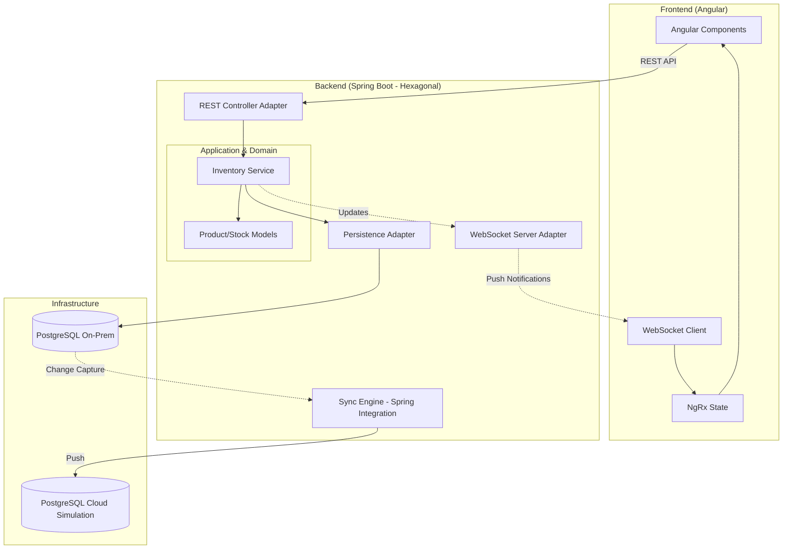

# Hybrid-Cloud SCM Hub

A comprehensive solution for bridging On-Premise warehouse operations with Cloud analytics.

## Tech Stack
- **Backend:** Java 21, Spring Boot 3.4, Hibernate, Spring Integration.
- **Frontend:** Angular 16, NgRx, SCSS, RxJS.
- **Database:** 2x PostgreSQL (On-Prem & Cloud simulation).
- **Architecture:** Hexagonal (Ports & Adapters).

## Project Structure
- `backend/`: Spring Boot application.
- `frontend/`: Angular application.
- `docker-compose.yml`: Infrastructure (Postgres).

## How to Run
1.  **Start Databases:**
    ```bash
    docker-compose up -d
    ```
2.  **Run Backend:**
    ```bash
    cd backend
    mvn spring-boot:run
    ```
3.  **Run Frontend:**
    ```bash
    cd frontend
    npm install
    npm start
    ```

## Key Features
- **Real-time Inventory Tracking:** Live updates via WebSockets (simulated).
- **Hybrid Sync Engine:** Automated data push from local to cloud instances.
- **Hexagonal Design:** Decoupled domain logic for high maintainability.
- **Optimistic Locking:** Robust concurrency handling for stock management.

## System Architecture & Request Flow

The system follows the **Hexagonal Architecture** (Ports & Adapters) to ensure business logic remains decoupled from external infrastructure.



### Request Flow Overview:
1.  **User Interaction:** The user performs an action in the Angular UI.
2.  **API Request:** The Frontend sends a REST request to the Backend.
3.  **Domain Processing:** The Application Service invokes Domain logic to validate and process the change.
4.  **Persistence:** The Persistence Adapter saves the state to the **On-Premise Database**.
5.  **Synchronization:** The **Sync Engine** (via Spring Integration) detects the local change and asynchronously synchronizes it to the **Cloud Database**.
6.  **Real-time Updates:** Successful changes trigger WebSocket notifications, allowing the UI to reflect updates across all connected clients instantly.
