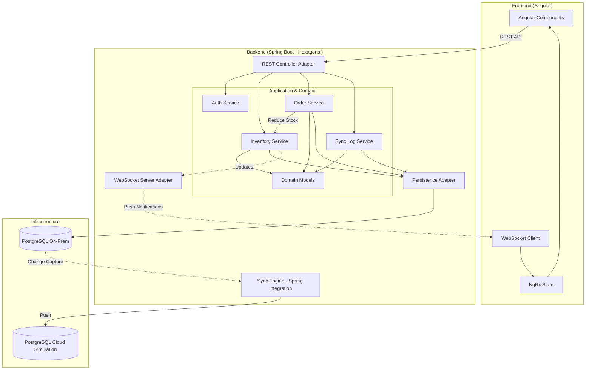
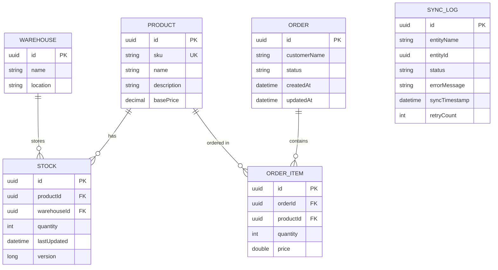

# Hybrid-Cloud SCM Hub

A comprehensive solution for bridging On-Premise warehouse operations with Cloud analytics.

## Tech Stack
- **Backend:** Java 21, Spring Boot 3.4, Hibernate, Spring Integration, **Spring Boot Actuator**.
- **Frontend:** Angular 16, NgRx, SCSS, RxJS.
- **Database:** 2x PostgreSQL (On-Prem & Cloud simulation).
- **Architecture:** Hexagonal (Ports & Adapters).

## Project Structure
- `backend/`: Spring Boot application.
- `frontend/`: Angular application.
- `docker-compose.yml`: Infrastructure (Postgres).

## How to Run
1.  **Start Databases:**
    ```bash
    docker compose up -d
    ```
2.  **Run Backend:**
    ```bash
    cd backend
    mvn spring-boot:run
    ```
3.  **Run Frontend:**
    ```bash
    cd frontend
    npm install
    npm start
    ```

## Testing

### 1. Backend Tests
Unit and integration tests (using Testcontainers). Requires Docker for integration tests.
```bash
cd backend
mvn test
```

### 2. Frontend Unit Tests
Karma and Jasmine tests.
```bash
cd frontend
# Run in watch mode
npm test
# Run one-time (headless)
npm test -- --watch=false --browsers=ChromeHeadless
```

### 3. Frontend E2E Tests (Cypress)
Requires both Backend and Frontend servers to be running.
```bash
# In separate terminal windows:
# 1. Start Backend: cd backend && mvn spring-boot:run
# 2. Start Frontend: cd frontend && npm start

# Then run Cypress:
cd frontend
npx cypress run
```

## Key Features
- **Real-time Inventory Tracking:** Live updates via WebSockets (simulated).
- **Hybrid Sync Engine:** Automated data push from local to cloud instances.
- **Hexagonal Design:** Decoupled domain logic for high maintainability.
- **Optimistic Locking:** Robust concurrency handling for stock management.
- **Health Monitoring:** Dedicated Actuator endpoints for tracking On-Prem and Cloud database connectivity.

## Monitoring & Health Checks
The application uses Spring Boot Actuator to provide production-ready monitoring.
- **Health Endpoint:** `GET /actuator/health`
- **Details:** The health check includes a custom `DatabaseHealthIndicator` that verifies connectivity to both the On-Premise and Cloud databases independently.

## System Architecture & Request Flow

The system follows the **Hexagonal Architecture** (Ports & Adapters) to ensure business logic remains decoupled from external infrastructure. While technically a modular monolith, the services are designed with microservice principles in mind (Inventory, Order, Sync Log).



## Database Schema

The following Entity Relationship Diagram (ERD) represents the data model used in the On-Premise database. This schema is mirrored (fully or partially) in the Cloud environment for analytics.



### Request Flow Overview:
1.  **User Interaction:** The user performs an action in the Angular UI (e.g., login, placing an order, or checking inventory).
2.  **API Request:** The Frontend sends a REST request to the Backend through the `REST Controller Adapter`.
3.  **Domain Processing:**
    *   **Authentication:** Handled by the `Auth Service` using JWT.
    *   **Inventory Requests:** Handled directly by the `Inventory Service`.
    *   **Order Requests:** Handled by the `Order Service`, which orchestrates with the `Inventory Service` to ensure stock availability and reduction.
4.  **Persistence:** The `Persistence Adapter` saves the state to the **On-Premise Database** (PostgreSQL).
5.  **Synchronization:** The **Sync Engine** (via Spring Integration) detects local DB changes and asynchronously synchronizes them to the **Cloud Database**.
6.  **Real-time Updates:** Successful inventory changes trigger `WebSocket` notifications via the `WebSocket Server Adapter`, allowing the UI to reflect updates across all connected clients instantly.
