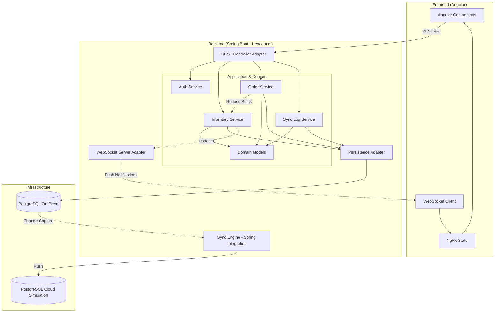
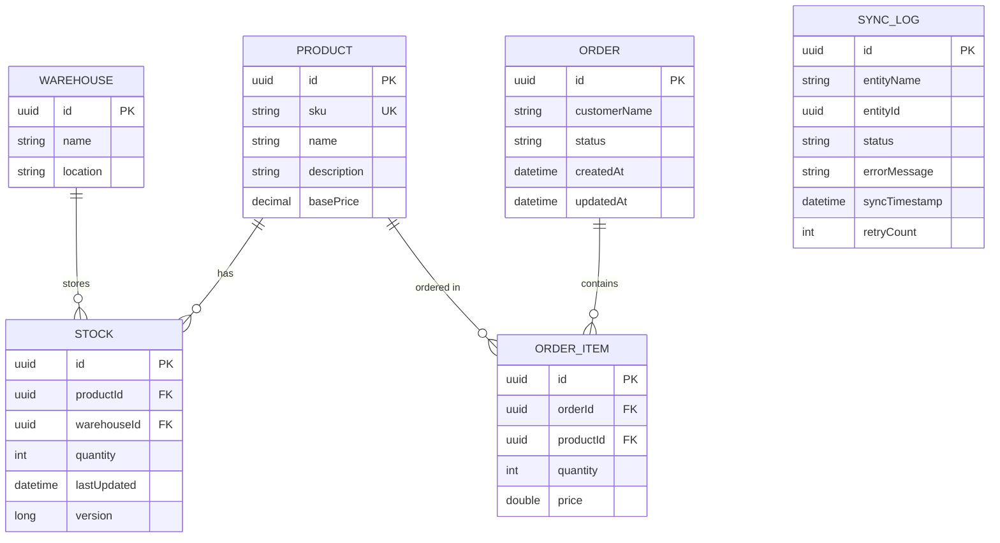

# Hybrid-Cloud SCM Hub

A comprehensive solution for bridging On-Premise warehouse operations with Cloud analytics.

## Tech Stack
- **Backend:** Java 21, Spring Boot 3.4, Hibernate, **Spring Integration (JDBC)**, **Spring Retry**, Spring Boot Actuator.
- **Frontend:** Angular 16, NgRx, SCSS, RxJS.
- **Database:** 2x PostgreSQL (On-Prem & Cloud simulation).
- **Architecture:** Hexagonal (Ports & Adapters).

## Project Structure
- `backend/`: Spring Boot application.
- `frontend/`: Angular application.
- `docker-compose.yml`: Infrastructure (Postgres).

## How to Run

### Option A: Full Application via Docker (Recommended)
This is the fastest way to run the entire stack (Databases, Backend, and Frontend).
```bash
docker compose up --build -d
```
The Frontend will be available at `http://localhost:80`, and the Backend API at `http://localhost:8080`.

### Option B: Manual Setup (Development Mode)

#### 1. Hybrid Infrastructure Setup
The project uses two separate PostgreSQL instances. Ensure Docker is running and execute:
```bash
docker compose up postgres-onprem postgres-cloud -d
```
**Database Port Mapping:**
- **On-Premise DB:** `localhost:5432` (Database: `scm_onprem`)
- **Cloud Simulation DB:** `localhost:5433` (Database: `scm_cloud`)

#### 2. Backend Service
Requires Java 21 and Maven.
```bash
cd backend
mvn spring-boot:run
```
*Note: On first run, Hibernate will automatically create the schema in both databases (`ddl-auto: update`).*

#### 3. Frontend Application
Requires Node.js and npm.
```bash
cd frontend
npm install
npm start
```
The UI will be available at `http://localhost:4200`.

## Verifying the Hybrid Setup

### 1. Connection Health
Verify that both database connections are active using the Spring Boot Actuator endpoint:
`GET http://localhost:8080/actuator/health`

Look for the `db` section in the JSON response to ensure both `onprem` and `cloud` status are `UP`.

### 2. Manual Sync Validation
To verify that data is correctly synchronizing from On-Premise to Cloud:
1. Create an order or update stock in the Frontend UI.
2. Check the **Audit Trail** tab in the UI for a `SUCCESS` status.
3. (Optional) Verify via CLI that the record exists in the Cloud instance:
```bash
# Query the Cloud instance (Port 5433)
psql -h localhost -p 5433 -U scm_user -d scm_cloud -c "SELECT * FROM products;"
```

## Testing

### 1. Backend Tests
Unit and integration tests (using Testcontainers). Requires Docker for integration tests.
```bash
cd backend
mvn test
```

### 2. Frontend Unit Tests
Karma and Jasmine tests.
```bash
cd frontend
# Run in watch mode
npm test
# Run one-time (headless)
npm test -- --watch=false --browsers=ChromeHeadless
```

### 3. Frontend E2E Tests (Cypress)
Requires both Backend and Frontend servers to be running.
```bash
# In separate terminal windows:
# 1. Start Backend: cd backend && mvn spring-boot:run
# 2. Start Frontend: cd frontend && npm start

# Then run Cypress:
cd frontend
npx cypress run
```

## Key Features
- **Real-time Inventory Tracking:** Live updates via WebSockets.
- **Message-Driven Sync Engine:** Robust data synchronization using Spring Integration and the **Transactional Outbox pattern**.
- **Resilience & Reliability:** Automatic retries with **Exponential Backoff** to handle transient failures during cloud synchronization.
- **Hexagonal Design:** Decoupled domain logic for high maintainability.
- **Optimistic Locking:** Robust concurrency handling for stock management.
- **Health Monitoring:** Dedicated Actuator endpoints for tracking On-Prem and Cloud database connectivity.

## Technical Lessons Learned (Gotchas)

- **SQL Initialization vs Hibernate DDL-Auto:** In Spring Boot 3.x, `data.sql` runs *before* Hibernate's schema generation by default. Setting `spring.sql.init.mode: always` while using `ddl-auto: update` can lead to startup failures (e.g., "Table not found") if the schema isn't already present. We keep it as `never` to ensure tests run smoothly with Testcontainers and only enable it explicitly via Docker Compose or manual override when seeding a fresh environment.
- **Testcontainers Performance:** Initially, each integration test class started its own set of Docker containers, leading to port conflicts and slow execution. We implemented the **Singleton Container pattern** in `AbstractIntegrationTest`, where containers are started once in a static block and shared across the entire test suite.
- **JPA Lazy Loading in Tests:** When verifying synchronization in the Cloud database using `EntityManager`, we encountered `LazyInitializationException` because the test session was different from the one used by the sync engine. We resolved this by using explicit `JOIN FETCH` queries in tests to eagerly load related entities (like `OrderItem`).
- **Data Type Consistency:** Notice that `ProductEntity` uses `BigDecimal` for precision in the catalog, while `OrderItemEntity` uses `Double` for historical snapshots. Our `CloudSyncProcessor` handles these mappings via direct JDBC to ensure high-performance upserts without Hibernate overhead.

## Monitoring & Health Checks
The application uses Spring Boot Actuator to provide production-ready monitoring.
- **Health Endpoint:** `GET /actuator/health`
- **Details:** The health check includes a custom `DatabaseHealthIndicator` that verifies connectivity to both the On-Premise and Cloud databases independently.

## System Architecture & Request Flow

The system follows the **Hexagonal Architecture** (Ports & Adapters) to ensure business logic remains decoupled from external infrastructure. While technically a modular monolith, the services are designed with microservice principles in mind (Inventory, Order, Sync Log).



## Database Schema

The following Entity Relationship Diagram (ERD) represents the data model used in the On-Premise database. This schema is mirrored (fully or partially) in the Cloud environment for analytics.



### Request Flow Overview:
1.  **User Interaction:** The user performs an action in the Angular UI (e.g., login, placing an order, or checking inventory).
2.  **API Request:** The Frontend sends a REST request to the Backend through the `REST Controller Adapter`.
3.  **Domain Processing:**
    *   **Authentication:** Handled by the `Auth Service` using JWT.
    *   **Inventory Requests:** Handled directly by the `Inventory Service`.
    *   **Order Requests:** Handled by the `Order Service`, which orchestrates with the `Inventory Service` to ensure stock availability and reduction.
4.  **Persistence:** The `Persistence Adapter` saves the state to the **On-Premise Database** (PostgreSQL) and creates a `SyncLog` entry (Transactional Outbox).
5.  **Synchronization:** The **Sync Engine** (via Spring Integration JDBC Polling) picks up pending logs and asynchronously synchronizes them to the **Cloud Database** with built-in retry logic.
6.  **Real-time Updates:** Successful inventory changes trigger `WebSocket` notifications via the `WebSocket Server Adapter`, allowing the UI to reflect updates across all connected clients instantly.
