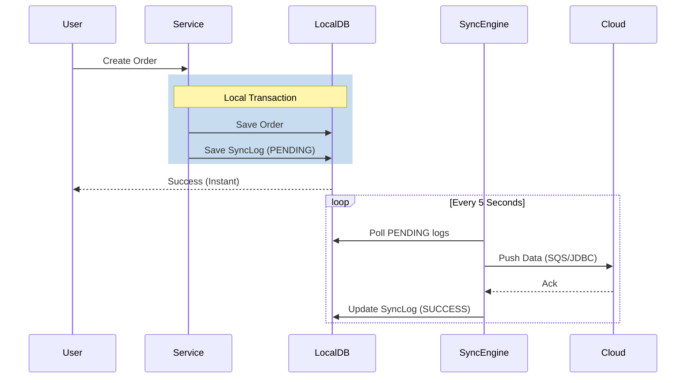

# Architecture Deep Dive: Reliability in Hybrid-Cloud Systems

This document explains the technical rationale behind the synchronization strategy used in the Hybrid-Cloud SCM Hub, specifically focusing on the **Transactional Outbox Pattern** and why we don't rely solely on message queues like Amazon SQS for initial data capture.

## The Challenge: The "Dual Write" Problem

In a hybrid system, we often need to do two things atomically:
1. Update the local state (On-Premise Database).
2. Notify external systems (Cloud Database / SQS / S3).

If we simply try to write to the database and then send a message to SQS, we face the **Dual Write Problem**. If the system crashes or the network fails *after* the database commit but *before* the SQS message is sent, the two systems become permanently out of sync. The cloud will never know about the local change.

## The Solution: Transactional Outbox Pattern

To solve this, we use the **Transactional Outbox** pattern via the `sync_logs` table (SyncLog).

### How it works:
1. **Atomic Transaction:** Instead of sending a message to SQS immediately, we save the `Order` and a `SyncLog` entry in the same local database transaction. 
   - *Result:* Either both are saved, or nothing is. We never have an "orphaned" order.
2. **Reliable Polling:** A background process (Spring Integration) polls the `sync_logs` table for `PENDING` records.
3. **Guaranteed Delivery:** The process attempts to push the data to the Cloud (via SQS or direct JDBC). Only after a confirmed success is the log marked as `SUCCESS`.

## Why not just use SQS directly?

While SQS is a robust message queue, using it as the *first* point of contact from the application layer has several drawbacks in an On-Premise environment:

### 1. Lack of Distributed Transactions
Java applications typically don't share a global transaction between a PostgreSQL database and an AWS SQS queue. The Outbox pattern emulates this atomicity using only the local database.

### 2. Resilience to Network Fluctuation
Warehouses often have unstable internet connections. 
- **Direct SQS:** If the internet is down, the application might hang or fail to process the user's request because it can't reach AWS.
- **SyncLog:** The application saves the data locally (instant speed) and the background sync engine waits patiently for the connection to return to "drain" the outbox.

### 3. Native Audit Trail & Visibility
By storing the sync state in a relational table:
- **UI Integration:** We can easily show the user a "Sync Status" dashboard in Angular. Querying SQS for the status of a specific order is complex and slow; querying a `sync_logs` table is trivial.
- **Error Tracking:** If a sync fails, we store the full stack trace in the `error_message` column, making debugging significantly easier.

### 4. Handling Different Sync Types
Not everything is a "Business Event" suited for SQS. 
- **Orders** are events (Good for SQS).
- **Stock Corrections** or **Product Updates** are state changes (Good for direct DB-to-DB sync).
The `SyncLog` provides a unified interface for both, ensuring consistency regardless of the underlying transport layer.

## Summary of the Flow

By choosing this architecture, the Hybrid-Cloud SCM Hub prioritizes **data integrity** and **local performance** over architectural simplicity, ensuring it can survive the "messy" reality of real-world networking.
